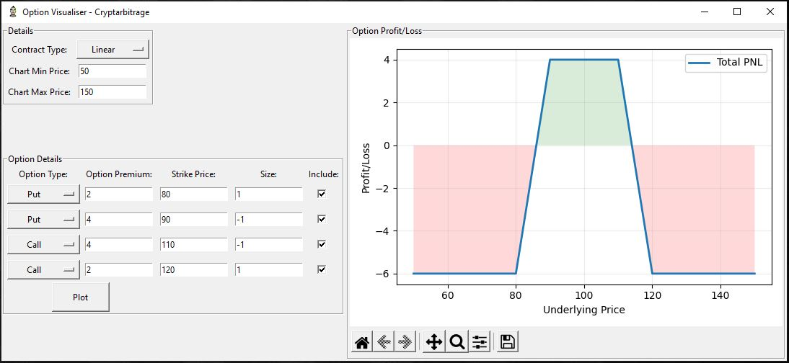
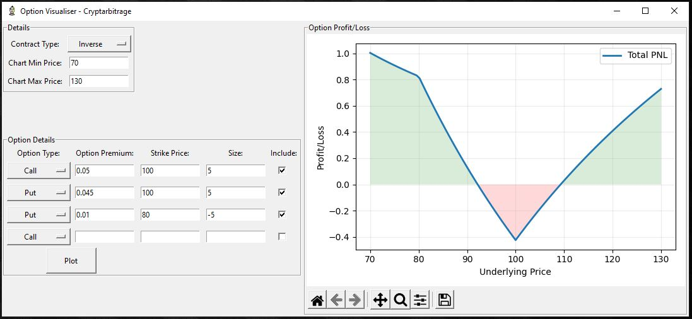

# Option Visualiser
Python code that visualises the profit/loss of both linear and inverse option contracts.

When using inverse contracts, be sure to enter the option premium in base currency terms, not in dollars.
For example if you are trading inverse BTCUSD options on Deribit, the premium is an amount of bitcoin (the base currency).

Go to https://github.com/cryptarbitrage-code/option-visualiser for the latest code.

Follow me on https://twitter.com/cryptarbitrage for other free resources and content.

Deribit ref-link: https://www.deribit.com/?reg=1332.557&q=home (10% discount on trading fees)

## GUI and Charts
Tkinter is used for the GUI, and Matplotlib is used to plot the charts.

